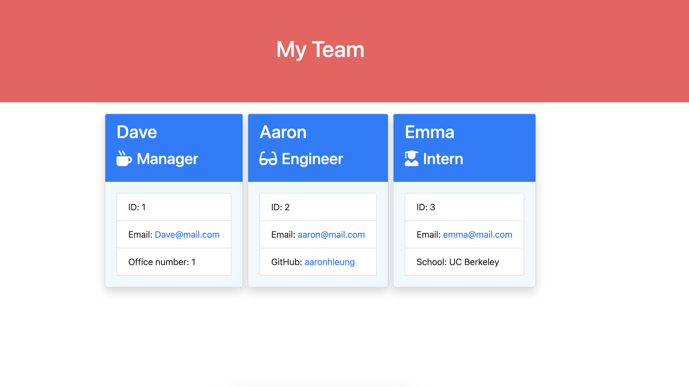

# Team Profile Generator

A server-side command line interface application that generates an HTML page based on user's input of employee information.

### Usage
* Run the node index.js command in terminal while in the root directory
* Answer the command line prompts
* When the questionaire is completed, an HTML page will be generated in the output folder.

### Technologies Used
HTML, CSS, JavaScript, Node.js, Jest, Inquirer, fs

Screenshot of a sample HTML page generated 

You can view a demo of the app [here](https://drive.google.com/file/d/1uSdHW2Y0HXe6AEoHCJYyTS5xYrBwb-2v/view)